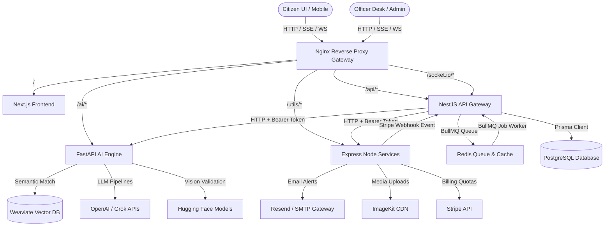

# JanSankalp AI — 4-Tier Microservices Architecture

This document outlines the enterprise-grade, highly-scalable **4-Tier Microservices Architecture** designed for the **JanSankalp AI Smart Civic Governance Platform**.

---

## 1. Architectural Blueprint

The platform is decoupled into four highly-focused, stateless, and independent microservice layers to support 200k–500k active users and massive background data telemetry processing.



---

## 2. Microservice Tiers Overview

| Service Name | Technology Stack | Exposed Port | Purpose & Primary Responsibilities |
| :--- | :--- | :--- | :--- |
| **`frontend`** | Next.js 14, TailwindCSS, SWR | `3000` | Renders citizen & officer dashboards, triggers maps, holds socket connection hook. |
| **`nest-api`** | NestJS, Prisma, BullMQ, Socket.io | `4000` | Core API Gateway, JWT & RBAC Auth, relational DB controller, redis caching, queue workers. |
| **`fastapi-ai`** | FastAPI, PyTorch, Weaviate, OpenAI | `8000` | Statistical computations, computer vision pothole validation, SSE streaming assistant, Q-learning RL. |
| **`node-services`** | Express, TypeScript, Stripe, Resend | `3001` | Decoupled utility processor for email notifications, Stripe billing webhooks, and secure upload signatures. |

---

## 3. Communication Protocols

1. **Service-to-Service Authorization**: All internal communication (e.g. `nest-api` proxying requests to `fastapi-ai` or calling `node-services` to send emails) is validated using custom HTTP header authorization:
   ```http
   Authorization: Bearer <INTERNAL_SERVICE_TOKEN>
   ```
2. **Real-time Gateway (WebSockets)**: Handled directly by NestJS utilizing Socket.IO on port `4000` mapped globally via Nginx `/socket.io/`.
3. **Real-time Streaming (SSE)**: FastAPI utilizes Server-Sent Events (`text/event-stream`) to stream chatbot and virtual assistant reasoning chunk-by-chunk for premium interactive experience.

---

## 4. Scaling & Performance Strategy

*   **Caching**: Uniform Redis caching is mounted on high-frequency queries (e.g. budget stats, department directories).
*   **Asynchronous Queuing**: NestJS registers BullMQ jobs in Redis. This keeps REST handlers non-blocking and processes complex ML classifications/deduplication in the background.
*   **Buffer Webhooks**: Decoupling the Stripe webhook signature verification into `node-services` ensures the primary API gateway is shielded from sudden surges in billing webhooks.
