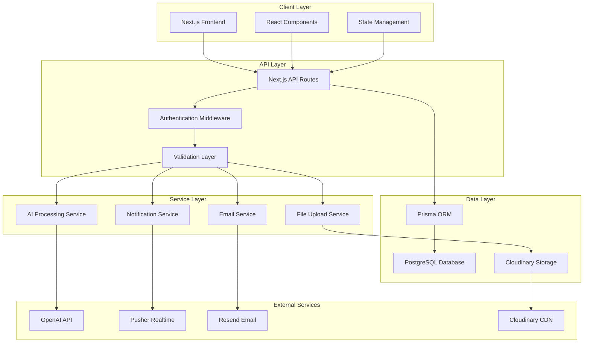
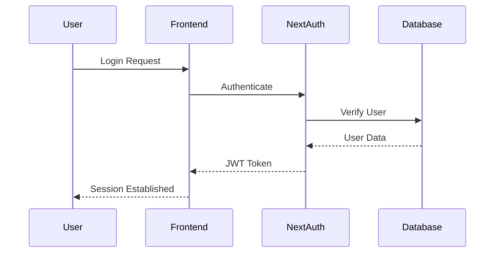
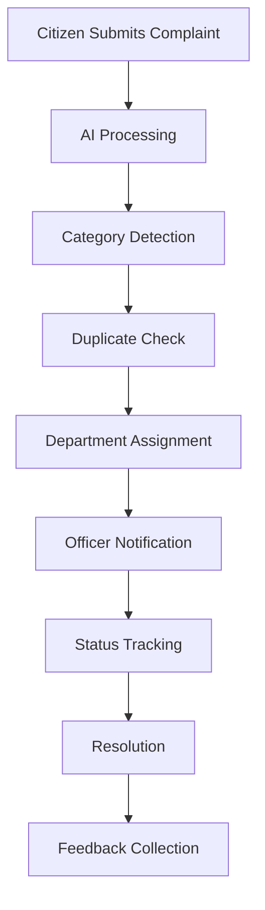
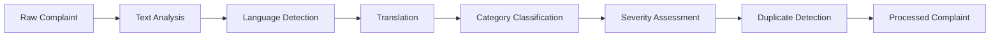

# 🏗️ JanSankalp AI - Architecture Documentation

## Overview

JanSankalp AI is a comprehensive civic complaint management system built with modern web technologies. It enables citizens to report municipal issues, track their resolution, and engage with local governance through AI-powered features.

## Tech Stack

### Frontend
- **Framework**: Next.js 14 (App Router)
- **Language**: TypeScript
- **Styling**: Tailwind CSS
- **UI Components**: Radix UI, Shadcn/ui
- **State Management**: React Query (TanStack Query)
- **Authentication**: NextAuth.js v5
- **Maps**: Leaflet, React Leaflet
- **Charts**: Recharts
- **Animations**: Framer Motion

### Backend
- **Runtime**: Node.js
- **Database**: PostgreSQL
- **ORM**: Prisma
- **Authentication**: NextAuth.js with Prisma Adapter
- **API**: Next.js API Routes
- **Real-time**: Pusher
- **File Upload**: Cloudinary
- **Email**: Resend

### AI & External Services
- **AI Processing**: OpenAI GPT-4
- **Translation**: OpenAI API
- **Image Processing**: Cloudinary
- **Analytics**: Google Analytics, Vercel Analytics

## System Architecture



## Project Structure

```
janSankalp-ai/
├── src/
│   ├── app/                    # Next.js App Router
│   │   ├── (auth)/            # Authentication routes
│   │   ├── (dashboard)/       # Dashboard routes
│   │   ├── api/               # API endpoints
│   │   ├── globals.css        # Global styles
│   │   ├── layout.tsx         # Root layout
│   │   └── page.tsx           # Home page
│   ├── components/            # Reusable components
│   │   ├── ui/                # Base UI components
│   │   ├── forms/             # Form components
│   │   ├── maps/              # Map components
│   │   └── charts/            # Chart components
│   ├── lib/                   # Utility libraries
│   │   ├── auth.ts            # Auth configuration
│   │   ├── prisma.ts          # Prisma client
│   │   ├── utils.ts           # Helper functions
│   │   └── validations.ts     # Zod schemas
│   ├── types/                 # TypeScript definitions
│   └── hooks/                 # Custom React hooks
├── prisma/
│   ├── schema.prisma          # Database schema
│   ├── migrations/            # Database migrations
│   └── seed.ts               # Database seeding
├── public/                    # Static assets
├── docs/                      # Documentation
└── .env.example              # Environment variables template
```

## Core Features Architecture

### 1. Authentication System


### 2. Complaint Management Flow


### 3. Real-time Updates
- **WebSocket Connection**: Pusher for real-time notifications
- **Event Types**: 
  - New complaint submitted
  - Status changes
  - Comments added
  - Assignments updated

### 4. AI Processing Pipeline


## Database Architecture

### Entity Relationships
- **Users**: Citizens, Officers, Admins
- **Complaints**: Core entity with status tracking
- **Departments**: Municipal departments
- **Remarks**: Comments and updates
- **Audit Logs**: System activity tracking

### Key Design Patterns
1. **Role-Based Access Control (RBAC)**
2. **Soft Deletes** (for audit trails)
3. **Optimistic Locking** (for concurrent updates)
4. **Event Sourcing** (for audit logs)

## Security Architecture

### Authentication Layers
1. **NextAuth.js** - Session management
2. **JWT Tokens** - Stateless authentication
3. **Role-Based Authorization** - Access control
4. **API Rate Limiting** - DDoS protection

### Data Protection
- **Encryption**: Passwords hashed with bcryptjs
- **PII Protection**: Sensitive data masked
- **Audit Trails**: All actions logged
- **Input Validation**: Zod schemas

## Performance Optimizations

### Frontend
- **Code Splitting**: Route-based splitting
- **Image Optimization**: Next.js Image component
- **Caching**: React Query caching
- **Lazy Loading**: Component-level lazy loading

### Backend
- **Database Indexing**: Optimized queries
- **Connection Pooling**: Prisma connection management
- **API Caching**: Response caching
- **CDN**: Static asset delivery

## Deployment Architecture

### Development
- **Local**: PostgreSQL, Next.js dev server
- **Docker**: Containerized environment
- **Hot Reload**: Development optimizations

### Production
- **Platform**: Vercel (recommended)
- **Database**: Managed PostgreSQL
- **CDN**: Vercel Edge Network
- **Monitoring**: Built-in analytics

## Scalability Considerations

### Horizontal Scaling
- **Stateless API**: Easy load balancing
- **Database Sharding**: User-based partitioning
- **Microservices**: Service decomposition ready

### Vertical Scaling
- **Resource Optimization**: Efficient queries
- **Memory Management**: Connection pooling
- **CPU Optimization**: Async processing

## Monitoring & Observability

### Metrics
- **Application Performance**: Response times
- **User Analytics**: Feature usage
- **Error Tracking**: Exception monitoring
- **Business Metrics**: Complaint resolution rates

### Logging
- **Structured Logging**: JSON format
- **Log Levels**: Debug, Info, Warn, Error
- **Correlation IDs**: Request tracking
- **Audit Logs**: Compliance requirements

## Future Architecture Plans

### Phase 2 Enhancements
1. **Microservices Migration**
2. **Event-Driven Architecture**
3. **Advanced AI Features**
4. **Mobile Application**

### Technology Roadmap
- **GraphQL**: API layer enhancement
- **Redis**: Caching layer
- **Elasticsearch**: Search capabilities
- **Kubernetes**: Container orchestration
