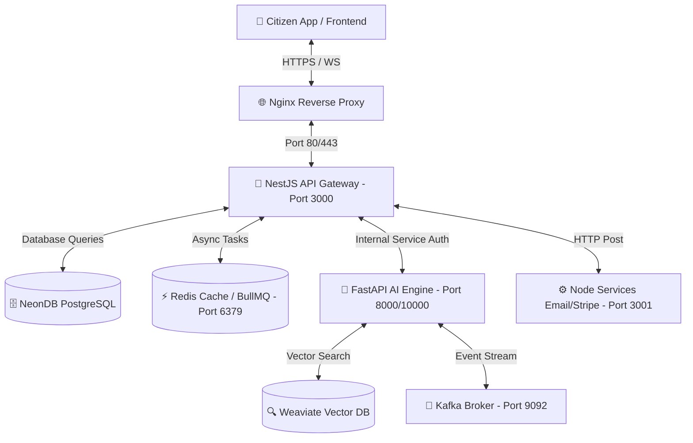

# 📚 JanSankalp AI - Documentation Hub

<div align="center">
  
  
  **Smart Civic Governance Platform for India**
  
  _AI-Powered · Real-Time Streaming · IoT Integration · Privacy-Preserving continuous learning_
</div>

---

## 🗂️ Navigation Hub

This hub contains the single source of truth for the entire JanSankalp AI ecosystem. All references below point to verified, active documents.

### 📋 Main Topics

| Section | Description | Active Documentation Links |
|---------|-------------|----------------------------|
| **🚀 Getting Started** | Local and containerized setup guides | [Setup Guide](guides/setup.md) • [Environment Config](guides/environment.md) |
| **🏗️ Architecture** | Technical layers, DB schema, and IoT data paths | [System Architecture](architecture/system-overview.md) • [System Design & DB Schema](architecture/system-design.md) • [Database Fields](architecture/database-schema.md) |
| **🔌 API Reference** | Complete endpoint definitions and auth patterns | [API Overview](api/README.md) • [Core API Details](api/overview.md) |
| **👥 User Manuals** | Guides customized by user role | [Citizen Guide](guides/citizen-guide.md) • [Officer Guide](guides/officer-guide.md) • [Admin Guide](guides/admin-guide.md) |
| **🌐 IoT & Streaming** | Sensors, Kafka messaging, and anomaly pipelines | [IoT Architecture](architecture/iot-architecture.md) |
| **🔐 Security** | Authentication guidelines and compliance requirements | [Security Guidelines](architecture/security-guidelines.md) • [OTP & Email Auth Setup](guides/otp-email-setup.md) |
| **🚀 Deployment** | Production environments, logs, and server management | [Production Deployment](deployment/complete-guide.md) • [Deployment Overview](deployment/overview.md) |
| **🔧 Troubleshooting** | Port mismatches, database locks, and common issues | [Troubleshooting Guide](troubleshooting/overview.md) |

---

## 📘 Contributor & Developer Playbook

Welcome! If you are a developer looking to fix bugs, optimize performance, or add a brand-new feature to JanSankalp AI, this section provides an actionable playbook for working inside our **4-tier microservice architecture**.

> [!NOTE]
> JanSankalp AI uses the **MVDC (Model-View-Database-Controller)** design paradigm. Business logic is carefully separated from gateways, API routing, and views to guarantee horizontal scaling.



---

### 🛠️ How to Add a New Feature (Step-by-Step)

To add a new feature (e.g., adding an "Emergency Medical Outreach" ticket category with SMS updates), follow these precise stages:

#### Step 1: Update the Database Schema (Prisma)
All primary structural entities live in PostgreSQL and are managed via Prisma in the frontend root.
1. Open the [Prisma Schema File](file:///c:/Users/arunk/Desktop/JanSankalp-AI/frontend/prisma/schema.prisma).
2. Add your new fields, relationships, or values (e.g., add `EMERGENCY_MEDICAL` to the `ComplaintCategory` enum).
3. Generate the updated Prisma client and execute the DB migration:
   ```bash
   cd frontend
   npx prisma generate
   npx prisma db push
   ```
4. Verify the database table changes using Prisma Studio:
   ```bash
   npx prisma studio
   ```

#### Step 2: Update the NestJS API Gateway & Controller
NestJS acts as the primary orchestrator, security gate, and gateway routing layer.
1. Add/modify the routing definitions or controllers under `backend/nest-api/src/`.
2. For example, to intercept or extend complaint routes, edit the controllers or services in `backend/nest-api/src/complaints/`.
3. If the feature requires heavy asynchronous processing (like queue scheduling), update the queue processors under `backend/nest-api/src/queue/processors/`.
4. Ensure the internal bearer token header is sent when calling downstream services:
   - Use `INTERNAL_SERVICE_TOKEN` defined in the config.

#### Step 3: Implement Core logic in the FastAPI AI Engine
The Python FastAPI microservice manages all ML models, computer vision detection, and semantic deduplication.
1. Add new processing logic inside `backend/fastapi-ai/app/services/` (e.g., a specific risk model, or vision validation service).
2. If this service needs to respond to HTTP requests, add routing in `backend/fastapi-ai/app/api/routes_ai.py`.
3. If it processes streaming events in the background, update `backend/fastapi-ai/app/events/stream_processor.py` to handle the appropriate Kafka topic subscription.
4. If you introduce new packages, list them in `backend/fastapi-ai/requirements.txt`.

> [!IMPORTANT]
> The FastAPI application listens on a dynamic port governed by the `PORT` environment variable (`${PORT:-8000}`). Ensure you do not hardcode port binding inside python files or dockerfiles.

#### Step 4: Add Secondary Integrations (Node Services)
The Express Node Services microservice is responsible for communications (SMTP emails, Resend), payments (Stripe), and media processing.
1. Add routing and configuration changes inside `backend/node-services/src/`.
2. Add the corresponding API endpoint to call your utility service.
3. Configure environment variables in `backend/node-services/.env`.

#### Step 5: Design and Render the Frontend View
The citizen and officer dashboards are built inside Next.js (under `frontend/`).
1. Create new visual components or hooks inside `frontend/src/components/` following our sleek HSL dark-mode system.
2. Hook up database reads/mutations using Next.js Server Actions or API client calls.
3. Enable real-time client side notifications by subscribing to Pusher channels if instant UI updates are required.

---

### 🛡️ Code Quality & Verification Checklist

Before staging your changes for commit, ensure you complete the following manual checks:

* **No Hardcoded Credentials**: Ensure all secrets (API Keys, JWT Secrets, Database passwords) are loaded exclusively via environment variables using dotenv or configuration loaders.
* **Environment Integrity**: Ensure `.env.example` lists all new keys added during the development of your feature.
* **Dynamic Ports**: Make sure your local execution works seamlessly when changing ports. Let the system bind to whatever `PORT` is passed to the container CMD.
* **Database Synchronization**: If database schema changes are made, verify that the seeding scripts (`prisma/comprehensive_seed.js`) run successfully without key constraint violations.
* **Graceful Fallbacks**: Ensure that heavy downstream systems (such as AI models or Kafka event streaming) are wrapped in appropriate error checking. If Kafka or a model loader is unreachable, the system must log a warning and fallback gracefully instead of throwing unhandled exceptions and crashing the main process.

---

## 🏛️ Project Guidelines

1. **Document Integrity**: Preserve all existing documents and maintain code documentation (docstrings, JSDoc comment blocks).
2. **Premium Design Aesthetics**: Any new frontend views must feel premium, featuring responsive grid layouts, harmonious Tailwind CSS combinations, subtle transitions, and glassmorphism elements where appropriate.
3. **Traceability**: Link back to system architecture charts and database design specifications using standard markdown links when writing code guides.

---

<div align="center">
  <p><strong>🇮🇳 JanSankalp AI - Smart Governance, Empowering Citizens</strong></p>
  <p><em>Platform Version: 2.0.0 (Production Tier)</em></p>
</div>
