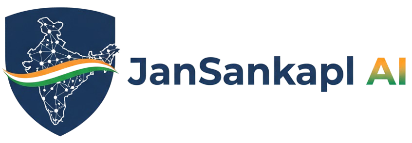

# 🏗️ System Design Architecture

<div align="center">
  
  
  **Complete System Design Documentation**
  
  _Architecture Patterns · Design Decisions · System Components_
</div>

---

## 📋 Table of Contents

1. [System Overview](#-system-overview)
2. [Architecture Principles](#-architecture-principles)
3. [System Components](#-system-components)
4. [Data Flow Architecture](#-data-flow-architecture)
5. [Security Architecture](#-security-architecture)
6. [Performance Architecture](#-performance-architecture)
7. [Scalability Architecture](#-scalability-architecture)
8. [Deployment Architecture](#-deployment-architecture)
9. [Integration Patterns](#-integration-patterns)
10. [Technology Stack](#-technology-stack)

---

## 🎯 System Overview

### System Purpose
JanSankalp AI is a comprehensive citizen grievance redressal system that leverages artificial intelligence to streamline complaint management, automate workflows, and provide real-time insights for government departments.

### Core Objectives
- **🎯 Citizen-Centric**: Provide seamless complaint filing experience
- **🤖 AI-Driven**: Intelligent classification and routing of complaints
- **⚡ Real-Time**: Live updates and notifications across all stakeholders
- **🔒 Secure**: Multi-layered security with role-based access control
- **📊 Data-Driven**: Analytics and insights for better governance

---

## 🏛️ Architecture Principles

### Design Principles

#### 1. **Microservices Architecture**
```
Benefits:
✅ Independent deployment and scaling
✅ Technology diversity per service
✅ Fault isolation and resilience
✅ Team autonomy and parallel development
```

#### 2. **API-First Design**
```
Benefits:
✅ Consistent interfaces
✅ Technology agnostic integration
✅ Version management
✅ Documentation-driven development
```

#### 3. **Event-Driven Architecture**
```
Benefits:
✅ Loose coupling between services
✅ Real-time data synchronization
✅ Scalable event processing
✅ Audit trail and replay capabilities
```

#### 4. **Cloud-Native Design**
```
Benefits:
✅ Containerization and orchestration
✅ Auto-scaling and self-healing
✅ Infrastructure as code
✅ Multi-cloud portability
```

### Architectural Goals

| Goal | Target | Metric |
|------|--------|--------|
| **Availability** | 99.9% | < 8.76 hours downtime/year |
| **Performance** | < 2s | 95th percentile response time |
| **Scalability** | 1M users | Horizontal scaling capability |
| **Security** | Zero-trust | Multi-layer security model |
| **Compliance** | Full | IT Act 2000, GDPR, RTI |

---

## 🧩 System Components

### High-Level Architecture Diagram
```
┌────────────────────────────────────────────────────────────────────┐
│                    JANSANKALP AI ECOSYSTEM                        │
│                                                                    │
│  ┌─────────────────┐  ┌─────────────────┐  ┌─────────────────┐    │
│  │   Frontend      │  │   Backend       │  │   AI Engine     │    │
│  │                 │  │                 │  │                 │    │
│  │ • Next.js App   │  │ • FastAPI       │  │ • PyTorch       │    │
│  │ • React UI      │  │ • Prisma ORM    │  │ • OpenAI        │    │
│  │ • TypeScript    │  │ • JWT Auth      │  │ • HuggingFace   │    │
│  │ • Tailwind CSS  │  │ • Redis Cache   │  │ • Computer Vision│    │
│  └─────────────────┘  └─────────────────┘  └─────────────────┘    │
│                                                                    │
│  ┌─────────────────┐  ┌─────────────────┐  ┌─────────────────┐    │
│  │   Data Layer    │  │   External      │  │   Infrastructure │    │
│  │                 │  │   Services      │  │                 │    │
│  │ • PostgreSQL    │  │ • ImageKit      │  │ • Docker/K8s    │    │
│  │ • Redis Cache   │  │ • Resend Email  │  │ • Nginx LB      │    │
│  │ • Kafka Stream  │  │ • Pusher WS     │  │ • Prometheus    │    │
│  │ • Weaviate      │  │ • Twilio SMS    │  │ • Grafana       │    │
│  └─────────────────┘  └─────────────────┘  └─────────────────┘    │
└────────────────────────────────────────────────────────────────────┘
```

### Component Breakdown

#### 1. **Frontend Layer**
```
Technology Stack:
├── Next.js 14 (React Framework)
├── TypeScript (Type Safety)
├── Tailwind CSS (Styling)
├── ImageKit (Image Management)
├── Pusher (Real-time Updates)
└── React Query (State Management)

Responsibilities:
✅ User Interface and Experience
✅ Client-side routing and navigation
✅ Form handling and validation
✅ Real-time data synchronization
✅ Authentication state management
✅ Responsive design for all devices
```

#### 2. **Backend Layer**
```
Technology Stack:
├── FastAPI (Python Framework)
├── Prisma ORM (Database Management)
├── JWT Authentication (Security)
├── Redis (Caching & Sessions)
├── PostgreSQL (Primary Database)
└── Kafka (Event Streaming)

Responsibilities:
✅ API endpoint management
✅ Business logic implementation
✅ Authentication and authorization
✅ Data validation and processing
✅ Real-time event handling
✅ Integration with external services
```

#### 3. **AI Engine Layer**
```
Technology Stack:
├── PyTorch (ML Framework)
├── OpenAI API (NLP Services)
├── HuggingFace (Computer Vision)
├── scikit-learn (Traditional ML)
├── NLTK/spaCy (Text Processing)
└── Weaviate (Vector Database)

Responsibilities:
✅ Complaint classification
✅ Sentiment analysis
✅ Image recognition and analysis
✅ Duplicate detection
✅ Priority assessment
✅ Department assignment logic
```

---

## 🌊 Data Flow Architecture

### Request Flow Pattern
```
📱 User Request Flow
┌─────────────┐    ┌─────────────┐    ┌─────────────┐    ┌─────────────┐
│   Client    │───▶│   Next.js   │───▶│   FastAPI   │───▶│  Database   │
│   Browser   │    │   Frontend  │    │   Backend   │    │ PostgreSQL  │
└─────────────┘    └─────────────┘    └─────────────┘    └─────────────┘
       │                   │                   │                   │
       │                   │                   │                   │
       ▼                   ▼                   ▼                   ▼
┌─────────────┐    ┌─────────────┐    ┌─────────────┐    ┌─────────────┐
│   React     │    │   API       │    │   Business  │    │   Data      │
│   Components│    │   Routes    │    │   Logic     │    │   Layer     │
└─────────────┘    └─────────────┘    └─────────────┘    └─────────────┘
```

### Real-time Data Flow
```
🔄 Real-time Update Flow
┌─────────────┐    ┌─────────────┐    ┌─────────────┐    ┌─────────────┐
│   Event     │───▶│   Kafka     │───▶│   Pusher    │───▶│   Client    │
│   Source    │    │   Stream    │    │   WebSocket │    │   Browser   │
└─────────────┘    └─────────────┘    └─────────────┘    └─────────────┘
       │                   │                   │                   │
       │                   │                   │                   │
       ▼                   ▼                   ▼                   ▼
┌─────────────┐    ┌─────────────┐    ┌─────────────┐    ┌─────────────┐
│   Database  │    │   Event     │    │   Real-time │    │   UI        │
│   Change    │    │   Bus       │    │   Channel   │    │   Update     │
└─────────────┘    └─────────────┘    └─────────────┘    └─────────────┘
```

### AI Processing Pipeline
```
🤖 AI Classification Flow
┌─────────────┐    ┌─────────────┐    ┌─────────────┐    ┌─────────────┐
│   Complaint │───▶│   Text      │───▶│   Model     │───▶│   Results   │
│   Input     │    │   Processing│    │   Inference │    │   Output    │
└─────────────┘    └─────────────┘    └─────────────┘    └─────────────┘
       │                   │                   │                   │
       │                   │                   │                   │
       ▼                   ▼                   ▼                   ▼
┌─────────────┐    ┌─────────────┐    ┌─────────────┐    ┌─────────────┐
│   Image     │    │   Feature   │    │   Multi-    │    │   Structured│
│   Analysis  │    │   Extraction│    │   modal     │    │   JSON      │
└─────────────┘    └─────────────┘    └─────────────┘    └─────────────┘
```

---

## 🔐 Security Architecture

### Multi-Layer Security Model
```
🛡️ Security Layers
├─ 🌐 Network Security
│  ├─ 🔥 Web Application Firewall (WAF)
│  ├─ 🚫 DDoS Protection (Cloudflare)
│  ├─ 🔒 SSL/TLS Encryption (TLS 1.3)
│  └─ 🌍 CDN Security (Edge protection)
├─ 🏛️ Application Security
│  ├─ 🔐 Authentication (JWT + Refresh tokens)
│  ├─ 🛡️ Authorization (RBAC + ABAC)
│  ├─ 🔍 Input Validation (Pydantic schemas)
│  ├─ 🚨 SQL Injection Prevention (ORM)
│  └─ 🛡️ XSS Protection (Content Security Policy)
├─ 💾 Data Security
│  ├─ 🔒 Encryption at Rest (AES-256)
│  ├─ 🔐 Encryption in Transit (TLS)
│  ├─ 🗑️ Data Masking (PII protection)
│  ├─ 🔄 Key Rotation (Automated)
│  └─ 📋 Access Logging (Audit trail)
└─ 👥 Operational Security
   ├─ 📋 Audit Logging (All actions)
   ├─ 👁️ Monitoring (24/7 surveillance)
   ├─ 🚨 Incident Response (Automated)
   ├─ 🧪 Penetration Testing (Quarterly)
   └─ 📚 Security Training (Regular)
```

### Authentication & Authorization Flow
```
🔐 JWT Authentication Flow
┌─────────────┐    ┌─────────────┐    ┌─────────────┐    ┌─────────────┐
│   User      │───▶│   Login     │───▶│   Token     │───▶│   Protected │
│   Request   │    │   Endpoint  │    │   Generation│    │   Resource  │
└─────────────┘    └─────────────┘    └─────────────┘    └─────────────┘
       │                   │                   │                   │
       │                   │                   │                   │
       ▼                   ▼                   ▼                   ▼
┌─────────────┐    ┌─────────────┐    ┌─────────────┐    ┌─────────────┐
│   Credentials│    │   Password  │    │   JWT       │    │   Role      │
│   Validation│    │   Verification│    │   Token     │    │   Check     │
└─────────────┘    └─────────────┘    └─────────────┘    └─────────────┘
```

### Role-Based Access Control (RBAC)
```
👥 Role Hierarchy
┌────────────────────────────────────────────────────────────────────┐
│                        ROLE PERMISSIONS                           │
│                                                                    │
│  🔴 ADMIN (Full Access)                                           │
│  ├─ User Management (CRUD)                                        │
│  ├─ Department Management (CRUD)                                  │
│  ├─ All Complaints (Read, Update, Assign)                         │
│  ├─ System Configuration                                           │
│  └─ Analytics & Reports                                           │
│                                                                    │
│  🟡 OFFICER (Department Access)                                    │
│  ├─ Assigned Complaints (Read, Update)                            │
│  ├─ Department Analytics (Read)                                   │
│  ├─ Citizen Notifications (Create)                               │
│  └─ Profile Management (Own)                                      │
│                                                                    │
│  🟢 CITIZEN (Limited Access)                                       │
│  ├─ Own Complaints (Create, Read)                                 │
│  ├─ Profile Management (Own)                                       │
│  └─ Notifications (Read)                                          │
└────────────────────────────────────────────────────────────────────┘
```

---

## ⚡ Performance Architecture

### Performance Optimization Strategy

#### Frontend Performance
```
🚀 Frontend Optimizations
├─ 📦 Bundle Optimization
│  ├─ Code splitting by routes
│  ├─ Tree shaking for unused code
│  ├─ Dynamic imports for heavy components
│  └─ Vendor chunk optimization
├─ 🖼️ Asset Optimization
│  ├─ Image optimization (WebP, AVIF)
│  ├─ Lazy loading for images
│  ├─ CDN delivery for static assets
│  └─ Resource hints (preload, prefetch)
├─ 🔄 Caching Strategy
│  ├─ Browser caching headers
│  ├─ Service worker for offline support
│  ├─ API response caching
│  └─ Component-level memoization
└─ 📱 Rendering Optimization
   ├─ Server-side rendering (SSR)
   ├─ Static site generation (SSG)
   ├─ Virtual scrolling for large lists
   └─ Debounced search and filters
```

#### Backend Performance
```
⚡ Backend Optimizations
├─ 🗄️ Database Optimization
│  ├─ Connection pooling
│  ├─ Query optimization with indexes
│  ├─ Read replicas for scaling reads
│  └─ Database caching strategies
├─ 🔄 API Optimization
│  ├─ Response compression (Gzip)
│  ├─ Rate limiting and throttling
│  ├─ Async request handling
│  └─ API response caching
├─ 💾 Memory Management
│  ├─ Redis caching layer
│  ├─ Session management optimization
│  ├─ Garbage collection tuning
│  └─ Memory leak prevention
└─ 🌐 Network Optimization
   ├─ HTTP/2 for multiplexing
   ├─ CDN for static content delivery
   ├─ Load balancing for distribution
   └─ Geographic routing (GeoDNS)
```

### Performance Metrics & Monitoring
```
📊 Key Performance Indicators
├─ 🎯 User Experience Metrics
│  ├─ Page Load Time: < 2 seconds
│  ├─ Time to Interactive: < 3 seconds
│  ├─ First Contentful Paint: < 1.5 seconds
│  └─ Cumulative Layout Shift: < 0.1
├─ 🔧 System Performance Metrics
│  ├─ API Response Time: < 500ms (95th percentile)
│  ├─ Database Query Time: < 100ms (average)
│  ├─ Cache Hit Ratio: > 90%
│  └─ Server CPU Usage: < 70%
└─ 📈 Business Metrics
   ├─ Complaint Processing Time: < 24 hours
   ├─ User Registration Conversion: > 80%
   ├─ Complaint Resolution Rate: > 95%
   └─ System Availability: 99.9%
```

---

## 📈 Scalability Architecture

### Horizontal Scaling Strategy
```
🔄 Auto-scaling Configuration
┌────────────────────────────────────────────────────────────────────┐
│                    SCALING DIMENSIONS                             │
│                                                                    │
│  🖥️ Frontend Scaling                                               │
│  ├─ Next.js instances: 3 → 20 pods                                │
│  ├─ Scaling triggers: CPU > 70%, Memory > 80%                      │
│  ├─ Scale-up time: 60 seconds                                     │
│  └─ Scale-down time: 300 seconds                                  │
│                                                                    │
│  ⚙️ Backend Scaling                                                │
│  ├─ FastAPI instances: 2 → 15 pods                                │
│  ├─ Scaling triggers: Request rate, Response time                │
│  ├─ Database connections: Pool management                         │
│  └─ Message queue: Kafka partition scaling                       │
│                                                                    │
│  💾 Database Scaling                                               │
│  ├─ Read replicas: 1 → 5 instances                               │
│  ├─ Connection pooling: 20 → 100 connections                      │
│  ├─ Sharding strategy: Geographic + Department-based              │
│  └─ Backup and replication: Multi-region                          │
└────────────────────────────────────────────────────────────────────┘
```

### Caching Architecture
```
💾 Multi-Level Caching Strategy
┌────────────────────────────────────────────────────────────────────┐
│                      CACHE LAYERS                                │
│                                                                    │
│  🌐 CDN Cache (Edge)                                               │
│  ├─ Static assets: Images, CSS, JS                                │
│  ├─ TTL: 1 year for versioned assets                              │
│  ├─ TTL: 1 hour for API responses                                 │
│  └─ Cache invalidation: Version-based                             │
│                                                                    │
│  🖥️ Application Cache (Redis)                                       │
│  ├─ User sessions: 30 days                                        │
│  ├─ API responses: 5 minutes                                      │
│  ├─ Database queries: 1 hour                                      │
│  └─ Rate limiting: 15 minutes                                     │
│                                                                    │
│  🗄️ Database Cache                                                 │
│  ├─ Query result cache: PostgreSQL query cache                     │
│  ├─ Index optimization: B-tree, Hash indexes                      │
│  ├─ Materialized views: Analytics data                            │
│  └─ Connection pooling: 20-100 connections                       │
└────────────────────────────────────────────────────────────────────┘
```

---

## 🚀 Deployment Architecture

### Container Strategy
```
🐳 Multi-Stage Docker Build
┌────────────────────────────────────────────────────────────────────┐
│                     CONTAINER ARCHITECTURE                        │
│                                                                    │
│  📦 Frontend Container (Next.js)                                   │
│  ├─ Base image: node:18-alpine                                    │
│  ├─ Builder stage: npm ci, npm run build                          │
│  ├─ Runner stage: Production-optimized                            │
│  ├─ Security: Non-root user, Minimal dependencies                 │
│  └─ Size optimization: ~150MB final image                        │
│                                                                    │
│  ⚙️ Backend Container (FastAPI)                                     │
│  ├─ Base image: python:3.11-slim                                  │
│  ├─ Dependencies: pip install --no-cache-dir                       │
│  ├─ Security: Non-root user, Minimal attack surface               │
│  ├─ Health checks: /health, /ready endpoints                      │
│  └─ Size optimization: ~200MB final image                        │
│                                                                    │
│  🤖 AI Engine Container                                             │
│  ├─ Base image: python:3.11-slim + CUDA                           │
│  ├─ ML dependencies: PyTorch, transformers, scikit-learn          │
│  ├─ Model storage: Persistent volume for models                   │
│  ├─ GPU support: CUDA-enabled when available                      │
│  └─ Size optimization: ~500MB with models                         │
└────────────────────────────────────────────────────────────────────┘
```

### Kubernetes Deployment
```
☸️ K8s Deployment Strategy
┌────────────────────────────────────────────────────────────────────┐
│                    KUBERNETES CLUSTER                             │
│                                                                    │
│  🏗️ Cluster Architecture                                           │
│  ├─ Control plane: 3 master nodes (HA)                            │
│  ├─ Worker nodes: 6+ nodes (auto-scaling)                        │
│  ├─ Storage: Persistent volumes for databases                     │
│  └─ Networking: CNI plugin, load balancer                         │
│                                                                    │
│  📦 Deployments                                                    │
│  ├─ Frontend: 3 replicas, HPA enabled                              │
│  ├─ Backend: 2 replicas, HPA enabled                              │
│  ├─ AI Engine: 1 replica, GPU node affinity                       │
│  ├─ Database: StatefulSet, 1 master + 2 replicas                 │
│  └─ Cache: Redis cluster, 3 masters + 3 replicas                  │
│                                                                    │
│  🔧 Services & Networking                                          │
│  ├─ Ingress controller: Nginx/Traefik                             │
│  ├─ Service mesh: Istio (optional)                                │
│  ├─ Load balancing: Round-robin, session affinity                │
│  └─ SSL termination: Let's Encrypt certificates                  │
└────────────────────────────────────────────────────────────────────┘
```

### CI/CD Pipeline
```
🔄 Continuous Integration/Deployment
┌────────────────────────────────────────────────────────────────────┐
│                      PIPELINE STAGES                              │
│                                                                    │
│  1️⃣ Code Commit                                                    │
│  ├─ Git push to feature branch                                    │
│  ├─ Automated testing trigger                                      │
│  └─ Code quality checks (ESLint, Pylint)                          │
│                                                                    │
│  2️⃣ Build & Test                                                  │
│  ├─ Unit tests: Jest, PyTest                                      │
│  ├─ Integration tests: API endpoints                              │
│  ├─ E2E tests: Playwright                                         │
│  ├─ Security scans: Snyk, Trivy                                  │
│  └─ Performance tests: Lighthouse, k6                            │
│                                                                    │
│  3️⃣ Build Images                                                   │
│  ├─ Docker image building                                         │
│  ├─ Image scanning for vulnerabilities                            │
│  ├─ Tagging with commit SHA                                       │
│  └─ Push to container registry                                    │
│                                                                    │
│  4️⃣ Deploy to Staging                                              │
│  ├─ Deploy to staging environment                                 │
│  ├─ Run smoke tests                                               │
│  ├─ Database migrations                                           │
│  └─ Manual approval required                                      │
│                                                                    │
│  5️⃣ Deploy to Production                                          │
│  ├─ Blue-green deployment strategy                                │
│  ├─ Health checks monitoring                                      │
│  ├─ Rollback capability                                           │
│  └─ Post-deployment verification                                  │
└────────────────────────────────────────────────────────────────────┘
```

---

## 🔗 Integration Patterns

### API Gateway Pattern
```
🚪 API Gateway Architecture
┌────────────────────────────────────────────────────────────────────┐
│                    API GATEWAY LAYER                             │
│                                                                    │
│  🛡️ Security & Authentication                                      │
│  ├─ JWT token validation                                          │
│  ├─ Rate limiting per user/IP                                      │
│  ├─ CORS policy enforcement                                       │
│  └─ Request/response logging                                      │
│                                                                    │
│  🔄 Request Routing                                                │
│  ├─ Path-based routing to microservices                           │
│  ├─ Load balancing across service instances                       │
│  ├─ Circuit breaker pattern implementation                        │
│  └─ Service discovery integration                                 │
│                                                                    │
│  📊 Monitoring & Analytics                                         │
│  ├─ Request metrics collection                                     │
│  ├─ Response time tracking                                        │
│  ├─ Error rate monitoring                                         │
│  └─ API usage analytics                                           │
└────────────────────────────────────────────────────────────────────┘
```

### Event-Driven Architecture
```
📨 Event Bus Implementation
┌────────────────────────────────────────────────────────────────────┐
│                    EVENT STREAMING                               │
│                                                                    │
│  🔄 Event Producers                                                │
│  ├─ Complaint service: Created, Updated, Assigned events          │
│  ├─ User service: Registered, Updated, Role changed events       │
│  ├─ Notification service: Email, SMS, Push events                │
│  └─ Analytics service: Metrics, KPI events                       │
│                                                                    │
│  📨 Event Bus (Kafka)                                              │
│  ├─ Topics: complaints, users, notifications, analytics            │
│  ├─ Partitions: 6 per topic for scalability                       │
│  ├─ Replication: 3x for fault tolerance                           │
│  └─ Retention: 7-90 days based on topic importance               │
│                                                                    │
│  👂 Event Consumers                                                │
│  ├─ Notification service: Send emails/SMS                         │
│  ├─ Analytics service: Update metrics and dashboards              │
│  ├─ AI service: Trigger classification and analysis               │
│  └─ Audit service: Log events for compliance                      │
└────────────────────────────────────────────────────────────────────┘
```

---

## 🛠️ Technology Stack

### Complete Technology Matrix

| Layer | Technology | Version | Purpose | Key Features |
|-------|------------|---------|---------|--------------|
| **Frontend** | Next.js | 14.x | Web Framework | SSR, API Routes, Middleware |
| | React | 18.x | UI Library | Components, Hooks, Context |
| | TypeScript | 5.x | Type Safety | Static typing, Interfaces |
| | Tailwind CSS | 3.x | Styling | Utility-first, Responsive |
| | ImageKit | Latest | Image Management | CDN, Optimization, Transformations |
| **Backend** | FastAPI | 0.104+ | API Framework | Auto-docs, Validation, Async |
| | Prisma | 5.x | ORM | Type-safe database access |
| | Pydantic | 2.x | Validation | Data schemas, Serialization |
| | JWT | PyJWT | Authentication | Token-based auth |
| **Database** | PostgreSQL | 15+ | Primary DB | ACID, JSON, Full-text search |
| | Redis | 7.x | Cache | Sessions, Rate limiting, Pub/Sub |
| | Weaviate | Latest | Vector DB | Semantic search, AI embeddings |
| **AI/ML** | PyTorch | 2.x | ML Framework | Deep learning, Neural networks |
| | OpenAI API | Latest | NLP Services | GPT-4, Classification |
| | HuggingFace | Latest | Computer Vision | Pre-trained models |
| | scikit-learn | 1.x | Traditional ML | Classification, Regression |
| **Infrastructure** | Docker | 24+ | Containerization | Microservices, Portability |
| | Kubernetes | 1.28+ | Orchestration | Scaling, Self-healing |
| | Nginx | 1.24+ | Reverse Proxy | Load balancing, SSL |
| | Kafka | 3.x | Streaming | Event streaming, Queue |
| **Monitoring** | Prometheus | Latest | Metrics | Time series data, Alerting |
| | Grafana | Latest | Visualization | Dashboards, Analytics |
| | Loki | Latest | Logging | Log aggregation, Search |

### Architecture Decision Records (ADRs)

#### ADR-001: Microservices Architecture
**Status**: Accepted  
**Context**: Need for scalable, maintainable system with independent team development  
**Decision**: Adopt microservices architecture with service boundaries based on business domains  
**Consequences**: Increased operational complexity, improved scalability and team autonomy

#### ADR-002: Next.js for Frontend
**Status**: Accepted  
**Context**: Need for SEO-friendly, performant web application with server-side capabilities  
**Decision**: Use Next.js 14 with App Router for frontend development  
**Consequences**: Improved SEO, better performance, React ecosystem benefits

#### ADR-003: FastAPI for Backend
**Status**: Accepted  
**Context**: Need for high-performance, async API with automatic documentation  
**Decision**: Use FastAPI with Python for backend services  
**Consequences**: Excellent performance, automatic OpenAPI docs, Python ecosystem

#### ADR-004: PostgreSQL as Primary Database
**Status**: Accepted  
**Context**: Need for reliable, feature-rich relational database with JSON support  
**Decision**: Use PostgreSQL 15+ as primary database  
**Consequences**: ACID compliance, JSON support, excellent tooling

#### ADR-005: Event-Driven Architecture
**Status**: Accepted  
**Context**: Need for real-time updates and loose coupling between services  
**Decision**: Implement event-driven architecture with Kafka  
**Consequences**: Real-time capabilities, improved resilience, eventual consistency

---

## 📊 System Monitoring & Observability

### Monitoring Stack
```
📊 Comprehensive Monitoring
┌────────────────────────────────────────────────────────────────────┐
│                    MONITORING STACK                               │
│                                                                    │
│  📈 Metrics Collection                                              │
│  ├─ Prometheus: System and application metrics                    │
│  ├─ Custom metrics: Business KPIs, user behavior                  │
│  ├─ Alerting: Grafana Alertmanager                               │
│  └─ Dashboards: Real-time system health                           │
│                                                                    │
│  📋 Logging Strategy                                               │
│  ├─ Structured logging: JSON format                               │
│  ├─ Log aggregation: Loki + Grafana                               │
│  ├─ Log levels: ERROR, WARN, INFO, DEBUG                         │
│  └─ Audit logs: All user actions tracked                          │
│                                                                    │
│  🔍 Distributed Tracing                                            │
│  ├─ OpenTelemetry: Standard instrumentation                       │
│  ├─ Jaeger: Trace collection and visualization                    │
│  ├─ Service mesh tracing: Inter-service calls                    │
│  └─ Performance analysis: Bottleneck identification              │
│                                                                    │
│  🚨 Alerting Strategy                                               │
│  ├─ Critical alerts: Service downtime, security incidents         │
│  ├─ Warning alerts: Performance degradation, resource usage       │
│  ├─ Notification channels: Email, Slack, SMS                     │
│  └─ Escalation policy: Tier-based alert routing                  │
└────────────────────────────────────────────────────────────────────┘
```

### Key Performance Indicators
```
📊 Business & Technical KPIs
┌────────────────────────────────────────────────────────────────────┐
│                    PERFORMANCE METRICS                            │
│                                                                    │
│  🎯 Business Metrics                                               │
│  ├─ Complaint registration rate: Target 1000/day                  │
│  ├─ Resolution time: Target < 24 hours                           │
│  ├─ User satisfaction: Target > 4.5/5                            │
│  └─ System adoption: Target 1M users in 1 year                    │
│                                                                    │
│  ⚡ Technical Metrics                                              │
│  ├─ API response time: P95 < 500ms                               │
│  ├─ Database query time: Average < 100ms                         │
│  ├─ Cache hit ratio: > 90%                                       │
│  ├─ Error rate: < 0.1%                                           │
│  └─ System availability: 99.9%                                    │
│                                                                    │
│  💾 Infrastructure Metrics                                         │
│  ├─ CPU utilization: < 70% average                               │
│  ├─ Memory usage: < 80% average                                  │
│  ├─ Disk I/O: < 80% capacity                                     │
│  ├─ Network bandwidth: < 70% utilization                         │
│  └─ Database connections: < 80% of pool size                     │
└────────────────────────────────────────────────────────────────────┘
```

---

## 🔮 Future Architecture Considerations

### Scalability Roadmap
```
🚀 Evolution Path
┌────────────────────────────────────────────────────────────────────┐
│                    ARCHITECTURE EVOLUTION                         │
│                                                                    │
│  📈 Phase 1: Current (MVP)                                         │
│  ├─ Monolithic deployment with microservice boundaries            │
│  ├─ Single database with read replicas                            │
│  ├─ Basic caching and monitoring                                  │
│  └─ Manual deployment and scaling                                 │
│                                                                    │
│  🔄 Phase 2: Growth (6-12 months)                                  │
│  ├─ Full microservices deployment                                 │
│  ├─ Database sharding by geography                               │
│  ├─ Advanced caching with CDN                                     │
│  └─ Automated scaling and deployment                              │
│                                                                    │
│  🌐 Phase 3: Scale (12-24 months)                                  │
│  ├─ Multi-region deployment                                       │
│  ├─ Event sourcing with CQRS                                      │
│  ├─ AI/ML pipeline optimization                                   │
│  └─ Advanced security and compliance                              │
│                                                                    │
│  🚀 Phase 4: Enterprise (24+ months)                               │
│  ├─ Hybrid cloud deployment                                       │
│  ├─ Blockchain integration for audit trail                       │
│  ├─ Advanced AI capabilities (predictive analytics)              │
│  └─ IoT integration for smart city initiatives                    │
└────────────────────────────────────────────────────────────────────┘
```

### Technology Evolution
```
🔮 Emerging Technologies
┌────────────────────────────────────────────────────────────────────┐
│                    TECHNOLOGY ROADMAP                             │
│                                                                    │
│  🤖 AI/ML Advancements                                             │
│  ├─ Large Language Models: Custom fine-tuning                    │
│  ├─ Computer Vision: Advanced image analysis                    │
│  ├─ Predictive Analytics: Trend forecasting                       │
│  └─ Federated Learning: Privacy-preserving ML                     │
│                                                                    │
│  🌐 Infrastructure Evolution                                        │
│  ├─ Edge Computing: Local processing for IoT                     │
│  ├─ Serverless: Function-based scaling                            │
│  ├─ WebAssembly: High-performance web applications                │
│  └─ Quantum Computing: Cryptographic security                    │
│                                                                    │
│  🔒 Security Enhancements                                          │
│  ├─ Zero Trust Architecture: Comprehensive security model          │
│  ├─ Homomorphic Encryption: Compute on encrypted data            │
│  ├─ Blockchain: Immutable audit trails                            │
│  └─ AI-powered Security: Automated threat detection               │
└────────────────────────────────────────────────────────────────────┘
```

---

## 📚 Conclusion

This comprehensive system design architecture provides a robust foundation for the JanSankalp AI platform. The architecture emphasizes:

- **🎯 Citizen-Centric Design**: Every component optimized for user experience
- **🤖 AI-Driven Intelligence**: Advanced ML capabilities for smart processing
- **⚡ High Performance**: Optimized for speed and scalability
- **🔒 Security First**: Multi-layered security protecting all data
- **📈 Future-Ready**: Designed to evolve with growing needs

The modular, microservices-based architecture ensures the system can scale horizontally while maintaining high availability and performance. The event-driven design enables real-time updates and loose coupling between components, making the system resilient and adaptable to changing requirements.

This architecture serves as a blueprint for building a world-class citizen grievance redressal system that can handle millions of users while providing intelligent, efficient, and secure services.

---

*Last Updated: March 2026*  
*Version: 1.0*  
*Author: JanSankalp AI Architecture Team*
