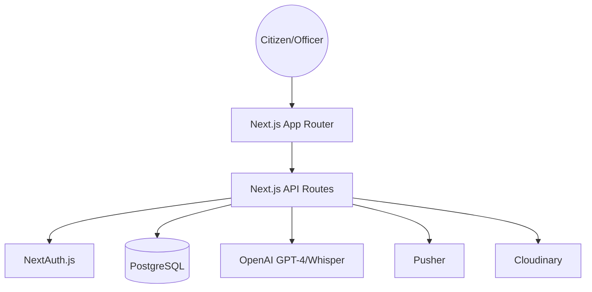

# System Architecture

## Hardware & Runtime

- **Runtime**: Node.js 18+
- **Database**: PostgreSQL (Prisma ORM)
- **Deployment**: Vercel (Edge-ready)

## Component Overview

### 1. Frontend Layer

Built with Next.js 14, using the App Router for server-side rendering and static generation. Tailwind CSS is used for styling, and Framer Motion for animations.

### 2. API Layer

Next.js Server Actions and API routes handle business logic. Zod is used for runtime schema validation.

### 3. Service Layer

- **AI Service**: Handles multilingual transcription, translation, and classification.
- **Notification Service**: Manages real-time Pusher events and Resend emails.
- **Storage Service**: Manages image and PDF generation/storage.

### 4. Data Layer

Prisma ORM connects to PostgreSQL. The schema is designed with RBAC (Citizen, Officer, Admin) at its core.
